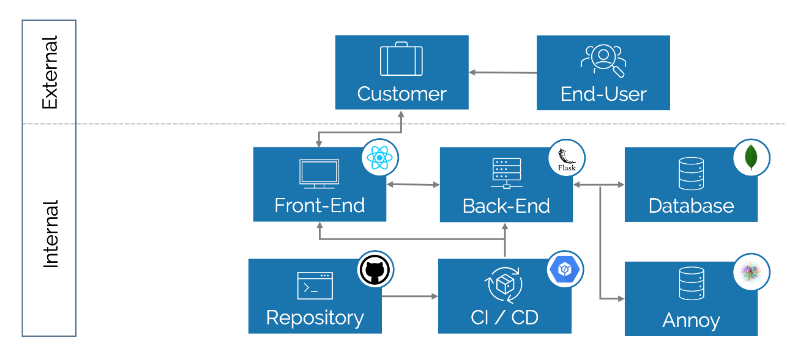

# FaceGuard App 
Welcome to the FaceGuard Application. This folder contains all files required for using the Demo-Case of FaceGuard.

## Solution Architecture
The image below outline our Solution Architecture. 
 

## Getting Started
For getting started, the installation you want to run this application on has to fulfill several requirements:
- python and npm installed
- g++ available on the system (for annoy in the backend)

On top of that, you must have access to several services:
- A Google Cloud Account with access to a Bucket
- A MongoDB (does not matter if running locally or on a cloud provider)

Please follow the steps outlined below:
- Run the backend (as described in backend/README)
- Run the fontend (as described in frontend/README)