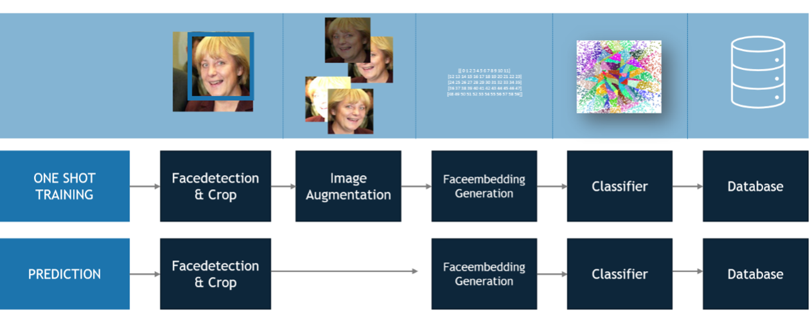

# FaceGuard: 
## An end to end approach for facerecognition  

Did you ever ask yourself why you still have to sign in with your password when browsing on your computer?

Mobile devices started supporting sign-in using the face almost decades ago. And even your laptop has an integrated webcam. FaceGuard is all about solving this issue: It is a simple SaaS-Solution for webpage or app creators than enables them to support the 2-Factor-Authentication method that nobody will forget: Their face. 

We implemented this project as part of the advanced practical course “Application Challenges for Machine Learning on the example of IBM Power AI” as part of our Master Studies at the Technical University of Munich. 

Read more [here](assets/paper.pdf) 
 

## Pipeline  

At the core of FaceGuard lies a one shot detection pipeline that allows to extract and process significant markers of a face (a so-called faceembedding) using a facemebedding model. This faceembedding is used to train a classifier and connected to the user data in the database. 
When a new user tries to sign in an image is taken, a faceembedding vector is generated and classified using an annoy classifier. 

## How to get started 
This repository is organized in two large chapters which you can both access separately. Both come with their own README. 
- *Faceembedding*: This chapter describes our process of training a faceembedding model describes the process of dataset creation, augmentation, model training and performance measurement.  
- *Faceclassification*: This chapter describes the prediction of faceembedding vectors using spotify's annoy model. It also includes includes performance measurements to compare annoy's performance against other approaches to predict persons from faceembeddings. 
- *faceguardapp*: This chapter combines the faceembedding model including the prediction in a holistic app: faceguard. The backend runs on python flask and the frontend on react ant design pro.  